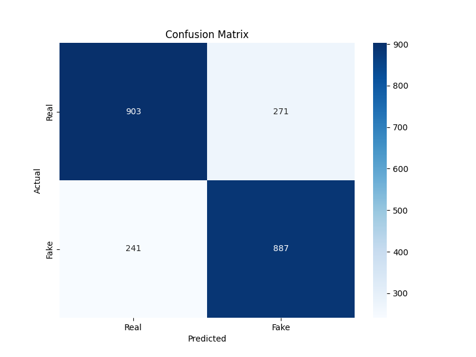

# Fake News Detection Project

This project aims to build a machine learning model to detect fake news articles. The model is trained on a dataset of labeled articles, where each article is classified as either "real" or "fake". By analyzing the textual content of the articles, the model predicts whether a given article is likely to be fake or real.

## Objective

The objective of this project is to develop an accurate fake news detection system that can help users distinguish between genuine and misleading information. By automatically identifying fake news articles, we aim to mitigate the spread of misinformation and promote the dissemination of trustworthy information.

## Usage

To run the fake news detection model and visualize the confusion matrix:
1. Clone the repository.
2. Install the required dependencies.
3. Run the script to train the model and generate the confusion matrix.
4. The confusion matrix image will be saved as `confusion_matrix.png` in the project directory.

## Confusion Matrix

The confusion matrix provides a visual representation of the performance of the fake news detection model. It shows the number of true positive, false positive, true negative, and false negative predictions made by the model.

## Model Accuracy

The accuracy of the fake news detection model was 78%.